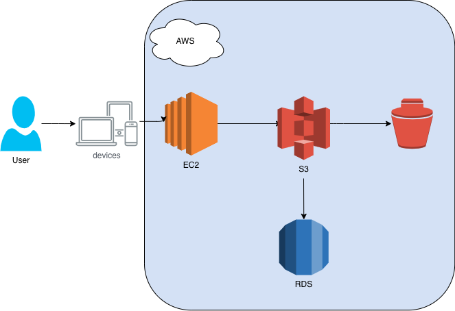

# ☁️ Gerenciamento de Instâncias EC2 na AWS  

---

## ⚙️ O que é o EC2?
O **Amazon EC2 (Elastic Compute Cloud)** permite criar e gerenciar **máquinas virtuais na nuvem AWS**, chamadas de *instâncias*.

É considerada um **IaaS (Infrastructure as a Service)** por fornecer a capacidade de computação na cloud AWS.

Cada instância EC2 é composta por:
- 🧮 **CPU**
- 💾 **Memória**
- 🧱 **Disco (EBS)**
- 🌐 **Rede**
- ⚙️ **Sistema Operacional (Linux ou Windows)**

Essas instâncias podem hospedar **aplicações, bancos de dados, servidores web ou ambientes de teste**.

## ⚠️ Atenção  
- Instâncias **paradas** ainda geram custo de **EBS**.  
- As ações do Toolkit dependem da **região AWS** selecionada.  

---

## ☁️ O que é o Amazon S3?  
O **Amazon S3 (Simple Storage Service)** é o serviço de **armazenamento de objetos** da AWS.  
Ele permite **armazenar, proteger e recuperar dados** de qualquer lugar da internet, de forma escalável e segura.  
S3 é amplamente usado para:
- Backup e restauração de dados  
- Hospedagem de sites estáticos  
- Armazenamento de logs, imagens e vídeos  
- Integração com serviços de Big Data e Machine Learning  

## 💰 Classes de Armazenamento  
| Classe | Uso Ideal | Custo |
|--------|------------|-------|
| **S3 Standard** | Dados acessados com frequência | 💲💲 |
| **S3 Intelligent-Tiering** | Dados com padrão de acesso variável | 💲 |
| **S3 Glacier / Deep Archive** | Arquivamento e backups de longo prazo | 💲 (muito baixo) |

---
## ⚙️ O que é o Amazon EBS?  
O **Amazon EBS (Elastic Block Store)** é um serviço de **armazenamento em bloco persistente** usado com **instâncias EC2**.  
Ele fornece volumes de armazenamento duráveis que podem ser **montados como discos virtuais** em uma máquina virtual na AWS.  

## 🧠 Boas Práticas  

- Use **Snapshots automáticos** para backup e recuperação.  
- Mantenha volumes e instâncias na **mesma zona de disponibilidade**.  
- Ative **criptografia** para proteger dados sensíveis.  
- Monitore desempenho com **Amazon CloudWatch**.  

---

---

### ✨ Autor
Desenvolvido por *[Viviane]* — Projeto de estudo AWS EC2.

