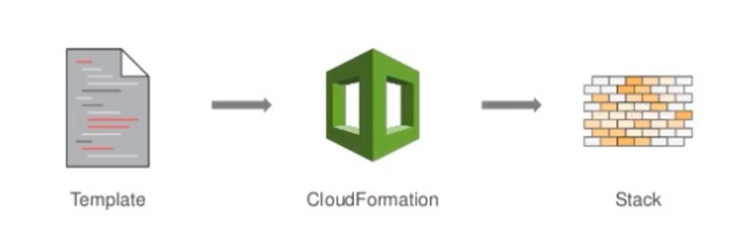

# 🌀 Implementando Infraestrutura Automatizada com AWS CloudFormation


---
## ⚙️ O que é o AWS CloudFormation 

**AWS CloudFormatio** é um modelo/template a ser seguido que descreve os recursos necessários da AWS, **automatizando** seu provisionamento e configuração, eliminando dessa forma configurações manuais permitindo foco no gerenciamento de aplicações.
É um processo simples e intuitivo de se realizar dentro da AWS.



| Benefício                | Descrição                                                                   |
| ------------------------ | ----------------------------------------------------------------------------|
|  **Automação**           | Automatiza o processo de criação, configuração e gerenciamento de recursos. |
|  **Padronização**        | Cria-se um modelo padrão de stacks que podem ser replicados.                |
|  **Economia de Custo**   | Usando o modelo padrão evita-se novas análises e avaliações.                |
|  **Segurança**           | Garante que os recursos são criados com regras e políticas de segurança.    |


---
## 🧩 Arquivos do AWS CloudFormation

Os arquivos para criação de templates podem ser criados via linguagem JSON ou YAML. Sendo o JSON baseado em chave-valor e o YAML uma linguagem mais simples e também mais preferida pelos usuários.

Exemplos de templates:

### Exemplo JSON

```text
{
  "Resources": {
    "MyInstance": {
      "Type": "AWS::EC2::Instance",
      "Properties": {
        "InstanceType": "t2.micro",
        "ImageId": "ami-12345678"
      }
    }
  }
}
```

### Exemplo YAML

```text
Resources:
  MyInstance:
    Type: "AWS::EC2::Instance"
    Properties:
      InstanceType: "t2.micro"
      ImageId: "ami-12345678"
```
---

## AWS CLoudFormation x Terraform

O Terraform também é uma ferramenta de automação de IaC suportado por vários provedores de Cloud. Já o AWS CLoud Formation é suportado somente no ambiente AWS.

---

## 🌩️ Conclusão

AWS CloudFormation é uma ótima ferramenta para replicação de recursos de infraestrutura mantendo o nível de padronização, gerenciamento e segurança.

----

## Referências
[📘 Documentação Oficial AWS CloudFormation](https://docs.aws.amazon.com/pt_br/forecast/latest/dg/tutorial-cloudformation.html)
