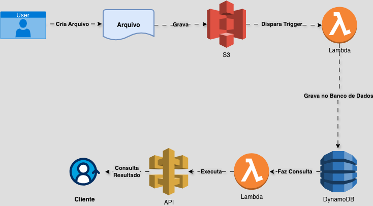

# 🌀 Executando Tarefas com Lambda Function e S3

---
## ⚙️ O que é o Amazon S3 

**Amazon S3** é um serviço de armazenamento em nuvem da AWS, funcionando como um repositório que suporta diferentes tipos de arquivos.
Armazena e acessa dados de forma segue e escalável, sendo ideal para backups e armazenamento de objetos.

| Vantagem                 | Descrição                                                                   |
| ------------------------ | ----------------------------------------------------------------------------|
|  **Durabilidade**        | Confiável e com redundância.                                                |
|  **Disponibilidade**     | Acesso contínuo aos dados.                                                  |
|  **Escalabilidade**      | Ajusta Automaticamente a capacidade de armazenamento conforme necessidade.  |
|  **Segurança**           | Oferece Criptografia e monitoramente de atividades.                         |

---

## ⚙️ O que é o AWS Lambda

**AWS Lambda** é um serviço de computação serveless (sem servidor) que executa códigos em resposta a eventos sem a necessidade de gerenciar servidores.
O **AWS Lambda** pode ser executado por no máximo 15 minutos e sua execução pode ser feita através de várias linguagens.

| Vantagem                 | Descrição                                                                   |
| ------------------------ | ----------------------------------------------------------------------------|
|  **Execução sob Demanda**| Executa apenas quando necessário.                                           |
|  **Escalabilidade**      | Se dá de forma automática com base em diferentes eventos.                   |
|  **Custo Eficiente**     | Cobra pelo tempo de execução e quantidade de solicitações.                  |
|  **Integração**          | Funciona como conector com outros serviços da AWS.                          |

---
## 🧩 Exemplo de Utilização

Um usuário necessita fazer um upload de arquivo com processamento e registro no DynamoDB

O objetivo é criar uma arquitetura automatizada que processa arquivos enviados para o Amazon S3, utilizando o AWS Lambda para gerenciar o fluxo e o DynamoDB como banco de dados de registro.

📤 Usuário faz o upload do arquivo que criou
        ↓
🧩 Step 1: Grava no S3
        ↓
🧩 Setep2: Verifica se há arquivos
        ↓
🧩 Step 3: Dispara Trigger (Lambda)
        ↓
🧩 Setep4: Grava no Bando de Dados (DynamoDB)
      
